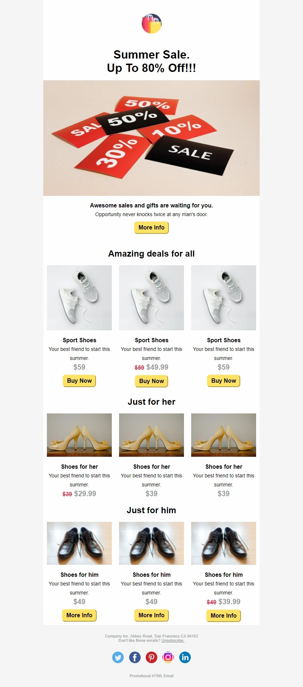
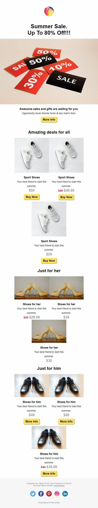
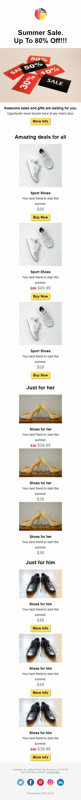

# Promotional HTML Email

This project was created in order to practice my skills with HTML, CSS.
Tested with PutsMail (Outlook 365, Yahoo mail, Gmail)

## Tech Stack

## Link
https://promo-html-email-agsfa1iqp-dnuns.vercel.app
  
## Demo

  
## Screenshots

### Desktop

---
### Mobile

---
### Mobile

---  
## Author

- [David Nunes](https://www.github.com/Dnuns)
